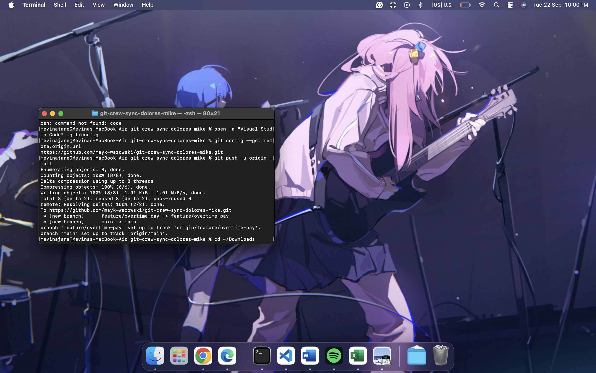
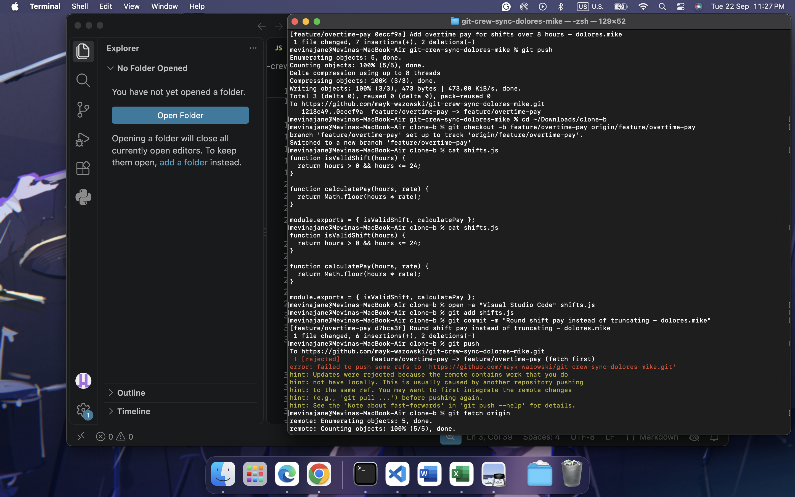
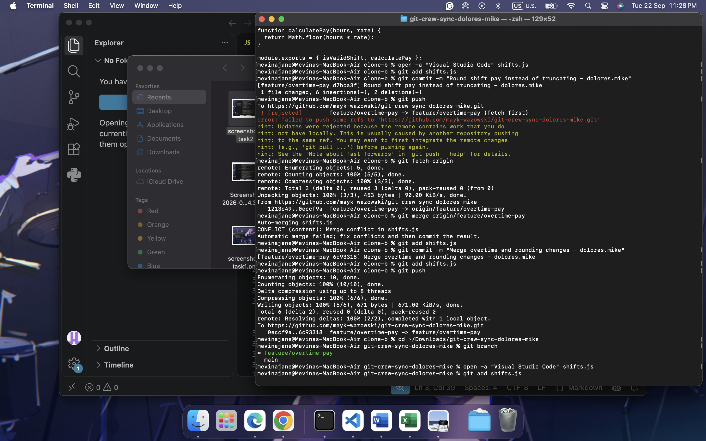
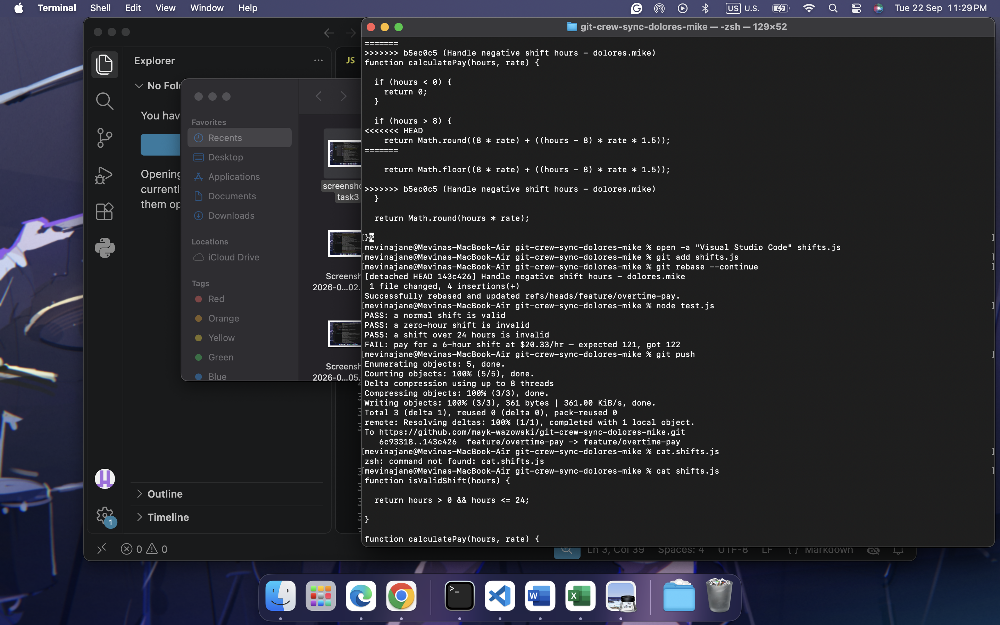
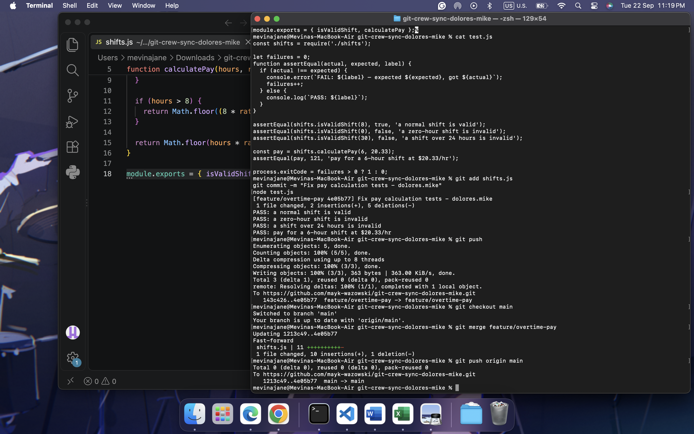
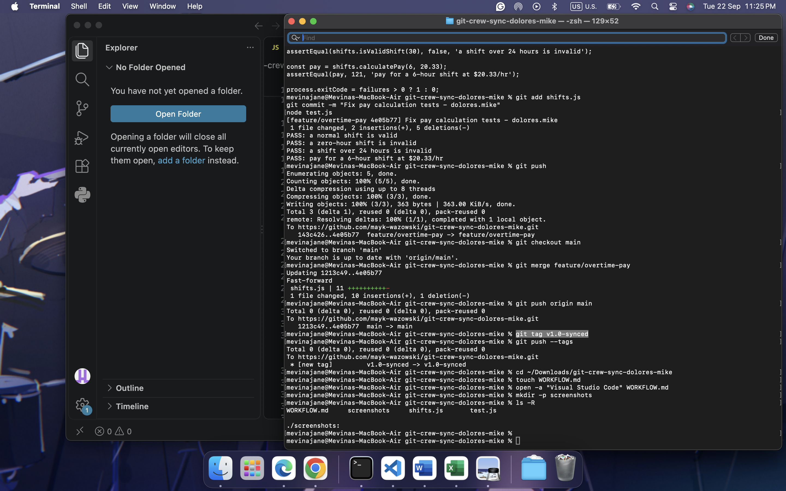

# Git Crew Sync Workflow - dolores.mike

## Task 1 - Push a Change from Clone A

Added overtime pay (time-and-a-half) for shifts over 8 hours and pushed the change to the `feature/overtime-pay` branch.

### Evidence

---

## Task 2 - Rejected Push from Clone B

Made a different change in Clone B and attempted to push without first fetching the latest remote changes. The push was rejected because the remote branch contained commits that were not present locally.

### Evidence

---

## Task 3 - Reconcile with a Merge

Fetched changes from the remote branch, merged them into Clone B, resolved the merge conflict, verified functionality, and pushed successfully.

### Evidence

---

## Task 4 - Reconcile with a Rebase

Made another change in Clone A, received another rejected push, then used `git fetch` and `git rebase` to replay local commits on top of the updated remote branch. Resolved the conflict, continued the rebase, verified functionality, and pushed successfully.

### Evidence

---

## Task 5 - Merge into Main

Merged `feature/overtime-pay` into `main` and pushed the updated main branch to GitHub.

### Evidence

---

## Task 6 - Tag Release

Created the tag:

`v1.0-synced`

and pushed it to GitHub.

### Evidence

---

# Questions

## What did the rejected push error message tell you, and why did it happen?

The rejected push error message indicated that the remote branch contained commits that were not present in my local branch. This happened because another clone had already pushed changes to the same branch, causing my local branch to fall behind the remote branch.

## What's the actual difference between how you resolved Task 3 (merge) vs Task 4 (rebase)?

In Task 3, I used **merge**, which combined both histories and created a merge commit to preserve the separate lines of development.

In Task 4, I used **rebase**, which replayed my local commits on top of the updated remote branch. This produced a cleaner and more linear commit history without creating a merge commit.

## What one habit would have avoided both rejected pushes in this lab?

A good habit would be to run `git fetch` or `git pull` before starting work and before pushing changes. This keeps the local branch synchronized with the remote branch and helps avoid rejected pushes.

## Which approach - merge or rebase - would you default to on a shared team branch, and why?

I would generally use **merge** on a shared team branch because it preserves the complete collaboration history and avoids rewriting commits that may already be used by other team members. Rebase is useful for maintaining a clean history, but merge is often safer for shared branches.